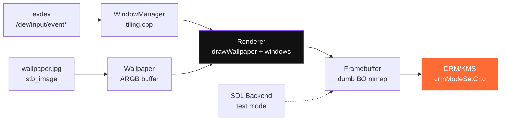

```
 ██▒   █▓ ██▓▓█████  █     █  ██████  █    ██  ███▄    █
▓██░   █▒▓██▒▓█   ▀  █ █ █ █ ▒██    ▒  ██  ▓██▒ ██ ▀█   █
 ▓██  █▒░▒██▒▒███    █ █ █ █ ░ ▓██▄   ▓██  ▒██░▓██  ▀█ ██▒
  ▒██ █░░░██░▒▓█  ▄  █ ▓ █ ▓ █ ▒   ██▒▓▓█  ░██░▓██▒  ▐▌██▒
   ▒▀█░  ░██░░▒████▒ █ ▒ ▒ █ ▒██████▒▒▒█████▓ ▒██░   ▓██░
   ░ ▐░  ░▓  ░░ ▒░ ░ ░ ░ ░ ░ ▒ ▒▓▒ ▒ ░▒▓▒ ▒ ▒ ░ ▒░   ▒ ▒
   ░ ░░   ▒ ░ ░ ░  ░   ░   ░ ░ ░▒  ░ ░░▒░ ░ ░ ░░   ░ ▒░
     ░░   ▒ ░   ░      ░   ░ ░  ░  ░  ░░░ ░ ░   ░   ░ ░
      ░   ░     ░  ░         ░       ░           ░
     ░
```

# Viewsun

### Fully custom tiling compositor — no X11, no Wayland. Owns the hardware.

> **Your pixels. Your rules. No compositor middleman.**

[](https://isocpp.org)
[](#-features)
[](#-architecture)
[](#-wallpaper)
[](#-why-viewsun)
[](/LICENSE)

[](/Makefile)
[](#-quick-start)
[](#-backends)

[Features](#-features) • [Quick Start](#-quick-start) • [Wallpaper](#-wallpaper) • [Demo](#-demo) • [Architecture](#-architecture) • [Backends](#-backends)

---

**Viewsun** is a from-scratch tiling window manager that talks directly to the Linux kernel — `DRM/KMS` for display, `evdev` for input, `GBM` dumb buffers for frames. No X11. No Wayland. No `Xorg.conf`.

Like `dwm` stripped to the metal, but you own every line: tiling, wallpaper, and framebuffer.

Perfect for: kiosks, minimal distros, learning display servers, and purists who want `init -> viewsun -> pixels`.

---

## ✨ Features

| Detail | |
|---|---|
| **🔲 Tiling First** | `master-stack` / `BSP` / `grid` — gaps, borders, `Alt+h/l` master resize |
| **🖼️ Wallpaper** | `viewsun -w ~/wall.jpg` — PNG/JPG/BMP via `stb_image`, aspect-fill, centered |
| **⚡ Bare Metal** | DRM dumb BO `mmap` → `drmModeSetCrtc` — directly scanned out, no compositor |
| **⌨️ Keyboard Driven** | `Alt+Enter` new, `Alt+q` close, `Alt+j/k` focus, `Alt+m/b/g` layouts |
| **🧩 Dual Backend** | `drm` (production) + `sdl` (dev fallback — test inside GNOME/KDE without VT) |
| **📟 Status Bar** | Built-in bar: layout / win count / master % — software rendered |
| **🪶 Tiny** | ~800 lines C++17, zero toolkit, `pkg-config libdrm sdl2` only |

### How it compares

| Tool | Display server | Wallpaper | Language | Needs X/Wayland |
|---|---|---|---|---|
| **Viewsun** | **direct DRM/KMS** | **builtin `-w`** | **C++17** | **no** |
| `dwm` | X11 | `feh`/`nitrogen` | C | Xorg |
| `i3`/`sway` | X11 / Wayland | external | C | yes |
| `kwin`/`mutter` | Wayland/X11 | integrated | C++ | yes |

> Viewsun is not an X window manager — it's a *display server*. Pair with `tinydm` if you need a login manager.

---

## 📸 Demo

```bash
$ viewsun -w ~/wallpaper.jpg --backend sdl --size 1280x720
viewsun: wallpaper loaded /home/avi/wallpaper.jpg (1920x1080)
viewsun: running 1280x720 backend=sdl wallpaper=/home/avi/wallpaper.jpg

# window fades in tiled — no Xorg in sight
$ viewsun --help
viewsun 0.1.0 - fully custom tiling compositor (no X11/Wayland)
Usage: viewsun [options]
  -w <path>            set wallpaper image (png/jpg/bmp)
  --backend <drm|sdl|auto>  select backend (default auto)
```

```
┌─────────────────────────────────────────────────┐
│ WIN1                 │ WIN2                      │
│                      ├───────────────────────────┤
│                      │ WIN3                      │
├──────────────────────┴───────────────────────────┤
│ LAYOUT: MASTER | WINS: 3 | MASTER:60%  ...      │
└─────────────────────────────────────────────────┘
  wallpaper fills behind, gaps = 8px
```

---

## 🚀 Quick Start

### Install

**make** *(recommended)*

**from source**

**arch**

```bash
git clone https://github.com/prabhutvasingh/viewsun && cd viewsun
make
sudo make install  # -> /usr/local/bin/viewsun
viewsun --help
```

```bash
git clone https://github.com/prabhutvasingh/viewsun
cd viewsun
make BACKEND=sdl   # dev inside desktop
make BACKEND=drm   # bare metal only
```

```bash
cd pkg && makepkg -si  # uses PKGBUILD -> /usr/bin/viewsun
```

Requires `gcc >= 12`, `libdrm`, `SDL2`, `pkg-config`.

Verify:

```bash
viewsun --help
viewsun --version  # 0.1.0
```

### 30-Second Tour

```bash
# 1. Set wallpaper (the only way — builtin)
viewsun -w ~/Pictures/wall.jpg

# 2. Test safely inside your desktop (no VT needed)
viewsun -w ./wall.jpg --backend sdl --size 1280x720

# 3. Go bare metal (needs TTY, no X/Wayland running)
sudo viewsun -w /usr/share/viewsun/wallpaper.png --backend drm
# or
sudo viewsun --card /dev/dri/card0 -w ~/wall.png

# 4. Controls
# Alt+Enter  new window   Alt+q close   Alt+Shift+q quit
# Alt+j/k    focus        Alt+h/l resize master
# Alt+m      master       Alt+b bsp     Alt+g grid
```

---

## 🖼️ Wallpaper

```bash
viewsun -w <path>          # PNG, JPG, BMP — stb_image decoded
viewsun --wallpaper <path> # long form
viewsun -w ~/wall.jpg --backend sdl  # test any image instantly
```

- Aspect-fill + center-crop (like `feh --fill`)
- Fallback solid `bg` `#282828` if no image
- Default search: `~/.config/viewsun/wallpaper.png` if `-w` omitted

Stored as `ARGB32` in `Wallpaper` (`include/wallpaper.h:5`) — blitted in `drawWallpaper()` (`src/wallpaper.cpp:36`) before windows.

---

## 📖 Usage

```
viewsun [OPTIONS]

Options:
  -w, --wallpaper <PATH>     set wallpaper image (png/jpg/bmp)
      --backend <drm|sdl|auto>  select backend (default auto: try drm, fallback sdl)
      --card <PATH>          DRM card (default /dev/dri/card1)
      --size WxH             force resolution (sdl)
  -h, --help                 show help
  -v, --version              show version

Examples:
  viewsun -w ~/wallpaper.jpg
  viewsun --backend sdl -w /tmp/bg.png
  sudo viewsun --backend drm -w /usr/share/viewsun/wallpaper.png
```

---

## 🏗️ Architecture



- **Tiling** `src/tiling.cpp` — `tileMasterStack()` / `tileBSP()` / `tileGrid()` — pure `Rect` math
- **Renderer** `src/renderer.cpp` — software blit: `fill()` → `drawWallpaper()` → `drawRect()`/borders → `drawText()` → status bar
- **Backend** `src/backend_drm.cpp` — `open(/dev/dri/card1)` → `drmModeGetResources` → `CREATE_DUMB` → `mmap` → `SetCrtc`; `src/backend_sdl.cpp` — `SDL_GetWindowSurface` for dev
- **Input** `evdev` poll + `SDL_KEYDOWN` → `InputEvent` (`KEY_*` from `linux/input-event-codes.h`)
- **Config** `include/common.h:12` — gaps, borders, `master_ratio`, colors, `wallpaper_path`

Search path is *purely local* — no X, no Wayland, no socket.

---

## 🔧 Backends

| Backend | Env | Use |
|---|---|---|
| `drm` | `/dev/dri/card1` + `/dev/input/event*` | Production — needs VT, `sudo` if no `video`/`input` group |
| `sdl` | SDL2 window | Dev — run inside any desktop, no permissions |
| `auto` | tries `drm` then `sdl` | Default — `viewsun -w wall.jpg` just works |

Force: `viewsun --backend drm| sdl` or `make BACKEND=drm|sdl`.

---

## ⚙️ Configuration

| Path / Env | Default | Purpose |
|---|---|---|
| `~/.config/viewsun/wallpaper.png` | — | Default if `-w` omitted |
| `VIEWSUN_CARD` | `/dev/dri/card1` | DRM card override |
| `--card` | `/dev/dri/card1` | CLI override |
| `include/common.h` | `gap=8 border=2 master=60%` | Compile-time defaults |

Edit `src/main.cpp:127` for startup windows, `include/common.h` for colors.

---

## 🗺️ Roadmap

- [ ] `viewsun --reload` — live wallpaper swap without restart
- [ ] IPC socket `~/.viewsun.sock` — `viewsun msg "wallpaper /new/bg.jpg"` + `viewsun msg "layout bsp"`
- [ ] EGL/GBM + shaders — rounded corners, blur behind
- [ ] `viewsun --config toml` — gaps, keys, autostart
- [ ] Client protocol — external apps via `SHM` buffers (Wayland-like, but viewsun-native)
- [ ] `fzf` + `rofi` launcher integration

Contributions that keep `backend` direct and tiling pure are welcome!

---

## 🤝 Contributing

```bash
git clone https://github.com/prabhutvasingh/viewsun && cd viewsun
make -j$(nproc)
./build/viewsun --backend sdl -w ./wall.jpg --size 1280x720
```

See issues for `good first issue` — tiling, wallpaper filters, input.

---

## 📄 License

MIT © Viewsun Contributors — see [LICENSE](/LICENSE).

---

**Viewsun** — *Own your pixels. Own your compositor.*

`make && sudo make install` • `viewsun -w ~/wall.jpg` • `Alt+Enter`

⭐ Star if bare-metal tiling matters to you.
